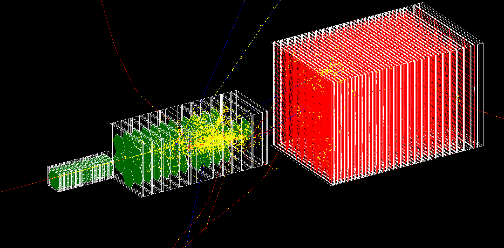

# HGCALTB
A Geant4 simulation of the 2018 CMS HGCAL test-beam for geant-val.

<figure>

<figcaption align="center"><b>Fig. - 20 GeV charged pion interacting in the HGCAL test beam hadronic section.</b></figcaption>
</figure>

<br/><br/>

<!-- TABLE OF CONTENTS -->
<details open="open">
  <summary>Table of Contents</summary>
  <ol>
    <li><a href="#project-description">Project description</a></li>
    <li><a href="#authors-and-contacts">Authors and contacts</a></li>
    <li>
      <a href="#results">Results</a>
      <ul>
        <li><a href="#selected-reports-and-presentations">Selected reports and presentations</a></li>
        <li><a href="#available-datasets-and-analyses">Available datasets and analyses</a></li>
      </ul>
    </li>
    <li>
      <a href="#how-to">How to</a>
      <ul>
        <li><a href="#build-compile-and-execute-on-maclinux">Build, compile and execute on Mac/Linux</a></li>
        <li><a href="#build-compile-and-execute-on-lxplus">Build, compile and execute on lxplus</a></li>
        <li><a href="#submit-a-job-with-htcondor-on-lxplus">Submit a job with HTCondor on lxplus</a></li>
      </ul>
    </li>
    <li><a href="#geant-val-integration">Geant Val integration</a></li>
    <li><a href="#selected-cms-hgcal-test-beam-references">Selected CMS HGCAL test beam references</a></li>
  </ol>
</details>

<!--Project desription-->
## Project description
The project targets a standalone Geant4 simulation of the [2018 CMS HGCAL test beam](https://arxiv.org/abs/2211.04740) to perform Geant4 regression testing, physics lists comparison and validation against test-beam data with geant-val.
- ⏰ Start date: 11 January 2024
- 📌 Status: development

<!--Authors and contacts-->
## Authors and contacts
- 👨‍🔬 Lorenzo Pezzotti (CERN EP-SFT) - lorenzo.pezzotti@cern.ch 
- 👨‍🔬 Alberto Ribon (CERN EP-SFT)
- 👨‍🔬 Sunanda Banerjee (CMS)

<!--Results-->
## Results

### Selected reports and presentations
- [Towards a Geant4 CMS HGCAL validation test](https://indico.cern.ch/event/1370020/contributions/5771288/attachments/2785706/4856878/lopezzot_23_1_2024.pdf), Geant4 simulation bi-weekly meeting, 23 January 2024

### Available datasets and analyses
| Dataset | Geant4 | HGCALTB | Comment |
| :---:   | :---:  | :---:   | :---:   |
| 0.2_1 | G4 11.2, 11.1.p01, 11.0.p02, 10.7.p03, 10.6.p03, 10.5.p01, 10.4.p03 <br> FTFP_BERT, QGSP_BERT, FTFP_BERT_ATL, FTFP_BERT_EMZ | 0.2 | Produced with geant-val, replaces all previous results on geant-val. |
| 0.1_1 | G4-11.2 <br> FTFP_BERT, QGSP_BERT, FTFP_BERT_ATL | 0.1 | Produced with geant-val for presentation on 23/1/2024. Removed from geant-val on 4/2/2023. |

<!--How to-->
## How to

### Build, compile and execute on Mac/Linux
1.  git clone the repo
    ```sh
    git clone https://github.com/geant-val/HGCALTB.git
    ```
2.  source Geant4 env
    ```sh
    source /relative_path_to/geant4.11.2-install/bin/geant4.sh
    ```
3.  cmake build directory and make
    ```sh
    mkdir HGCALTB-build && cd HGCALTB-build/
    cmake -DGeant4_DIR=/absolute_path_to/geant4.11.2-install/lib/Geant4-11.2/ relative_path_to/HGCALTB/
    make
    ```
4.  execute (example with HGCALTBrun.mac macro card, 2 threads and FTFP_BERT physics list)
    ```sh
    ./HGCALTB -m HGCALTBrun.mac -t 2 -p FTFP_BERT
    ```

### Build, compile and execute on lxplus
1. git clone the repo
   ```sh
   git clone https://github.com/geant-val/HGCALTB.git
   ```
2. cmake build directory and make (using geant4-11.2, check for gcc and cmake dependencies for other versions)
   ```sh
   mkdir HGCALTB-build && cd HGCALTB-build/
   cp ../HGCALTB/scripts/HGCALTB_cvmfs_setup.sh ../HGCALTB/scripts/HGCALTB_lxplus_11.2.sh .
   source ./HGCALTB_lxplus_11.2.sh
   ```
3. execute (example with HGCALTBrun.mac macro card, 4 threads and FTFP_BERT physics list)
   ```sh
   ./HGCALTB -m HGCALTBrun.mac -t 4 -p FTFP_BERT
   ```

### Submit a job with HTCondor on lxplus
1. [First follow the build instructions on lxplus](#build-compile-and-execute-on-lxplus)
2. prepare for HTCondor submission (example with Geant4.11.2, HGCALTBrun.mac, 4 threads, FTFP_BERT physics list)
    ```sh
    mkdir -p error log output
    cp ../HGCALTB/scripts/HGCALTB_HTCondor.sub ../HGCALTB/scripts/HGCALTB_HTCondor_11.2.sh .
    sed -i "2 i cd $(pwd)" HGCALTB_HTCondor_11.2.sh
    echo ./HGCALTB -m HGCALTBrun.mac -t 4 -p FTFP_BERT >> HGCALTB_HTCondor_11.2.sh
    sed -i "1 i executable = HGCALTB_HTCondor_11.2.sh" HGCALTB_HTCondor.sub
    ```
3. submit a job
   ```sh
   condor_submit HGCALTB_HTCondor.sub 
   ```
4. monitor the job
   ```sh
   condor_q
   ```
   or (for persistency)
   ```sh
   condor_wait -status log/*.log
   ```
5. additional info from HTCondor (optional) \
   rm all your jobs
    ```sh
   condor_rm username
   ```
   inspect your accounting group
   ```sh
   condor_q owner $LOGNAME -long | grep '^AccountingGroup' | sort | uniq -c
   ```
   display all accounting groups
   ```sh
   haggis group list
   ```
   display your accounting groups
    ```sh
   haggis rights
   ```
   check what accounting group a job has
   ```sh
   condor_q jobid.0 -af AccountingGroup
   ```
   specify the accounting group for yout job, to be added in the .sub file
   ```sh
   +AccountingGroup = "group_u_*"
   ```
   check job CPU usage
   ```sh
   condor_q -l jobid.0 | grep CPUsUsage
   ```
   ssh to machine where job is running
   ```sh
   condor_ssh_to_job jobid.0
   ```

<!--Geant Val integration-->
## Geant Val integration
[Geant Val](https://geant-val.cern.ch/) is the Geant4 testing and validation suite. It is a project hosted on [gitlab.cern.ch](https://gitlab.cern.ch/GeantValidation) used to facilitate the maintenance and validation of Geant4 applications, referred to as <em>tests</em>.\
The following are instructions to use HGCALTB within Geant Val, from batch submission to website deployment.
1. **On lxplus**, clone HGCALTB and the Geant Val geant-config-generator
   ```sh
   https://github.com/geant-val/HGCALTB.git
   git clone https://gitlab.cern.ch/GeantValidation/geant-config-generator.git
   ```
2. [Follow the build instructions on lxplus](#build-compile-and-execute-on-lxplus)
3. Copy the HGCALTB geant val scripts into ```tests/geant4/```
   ```sh
   cp -r HGCALTB/geantval_scripts/HGCALTB/ geant-config-generator/tests/geant4/
   mkdir -p geant-config-generator/tests/geant4/HGCALTB/files
   cp HGCALTB/TBHGCal181Oct.gdml HGCALTBTB/analysis/energy.C HGCALTBTB/analysis/emprofile.C geant-config-generator/tests/geant4/HGCALTB/files/
   ```
3. We will execute HGCALTB via Geant Val using Geant4.11.2, therefore we must make sure the file ```11.2.sh``` exists in ```configs/geant/```. In the file ```11.2.sh``` we also export the path to the HGCALTB executable (compiled with 11.2). \
   Copy the config file using:
   ```sh
   ./HGCALTB/geantval_scripts/cpconf.sh \
      HGCALTB/geantval_scripts/configs/11.2.sh \
      geant-config-generator/configs/geant4/ \
      $(pwd)/HGCALTB-build
   ```
4. Create macros and metadata for Geant Val execution
   ```sh
   cd geant-config-generator
   ./mc-config-generator.py submit -t HGCALTB -d OUTPUT -v 11.2 -q "testmatch" -r
   ```
   this command creates the Geant Val files for batch submission using HTCondor under the ```OUTPUT``` folder, using HGCALTB, Geant4.11.2 and the ```testmatch``` job flavor.
5. To monitor the jobs use
   ```sh
   ./mc-config-generator.py status -t HGCALTB -d OUTPUT
   ```
   When the job execution ends, the root output files are stored in the corresponding job folder. Each job folder will look like this:
   ```
   HGCALTB-env.log  test_stderr.txt  test_stdout.txt
   HGCALTB.json  HGCALTB.mac HGCALTBout_Run0.root
   HGCALTB.sh  bsub.sh  config.sh  
   ```
6. Execute the analysis on the root files in the `OUTPUT` folder to create Geant Val JSON output files
   ```sh
   ./mc-config-generator.py parse -t HGCALTB -d OUTPUT
   ```
7. The last part is to deploy the results on Geant Val. The HGCALTB layout on the Geant Val
   website is defined in the HGCALTB.xml file on [gitlab.com/thegriglat/geant-val-layouts](https://gitlab.com/thegriglat/geant-val-layouts)
   (additional info are in the tags.json file).
   Deploy JSON files on the Geant Val database
   ```sh
    find . -name '*.json' | while read i; \
      do curl -H "Content-Type: application/json" -H "token: askauthor" --data @$i https://geant-val.cern.ch/upload; \
      echo; done

<!--Selected CMS HGCAL test beam references-->
## Selected CMS HGCAL test beam references
- 📄 <em>Performance of the CMS High Granularity Calorimeter prototype to charged pion beams of 20−300 GeV/c</em>, [arXiv:2211.04740](https://arxiv.org/abs/2211.04740), 27 May 2023
- 📄 <em>Response of a CMS HGCAL silicon-pad electromagnetic calorimeter prototype to 20-300 GeV positrons</em>, [arXiv:2111.06855](https://arxiv.org/abs/2111.06855), 31 March 2022
